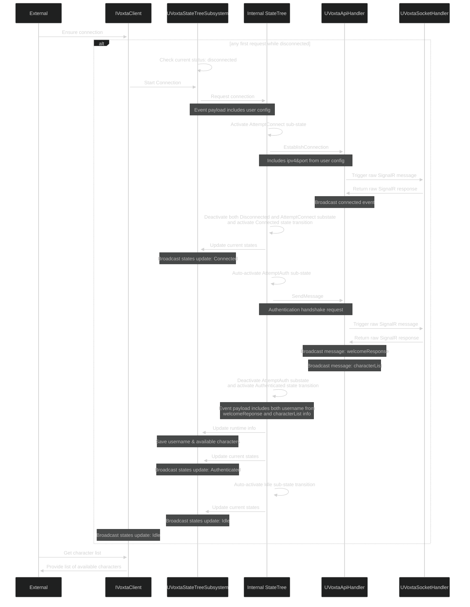

## Elements
* External: The invoking code outside the plugin. Can be anything but must be running on the gamethread.
* IVoxtaClient: The public-facing API of the plugin. Physically lives on the UVoxtaStateTreeSubsystem but hides derived functionality from the subsystem itself.
* UVoxtaStateTreeSubsystem: Main 'container' that persists across the entire gameinstance and effectively holds all (sub)components either directly or indirectly. Important: Takes zero action by itself, only forwards Interface requests to it's statetree.
  * Holds the StateTree component and thus indirectly owns all its tasks.
  * Holds the UserConfigData compoment and thus, which itself contains the user provided ipv4 and port for the VoxtaServer host.
  * Holds the RuntimeData compoment, which has the serverside info (username, version etc.) as well as the available characters and their metadata (including avatar image, etc.)
* Internal StateTree: The UnrealStateTree object that dictates the actions taken by the plugin. States are influenced by Events comfing from the UVoxtaStateTreeSubsystem itself (forwarded from the public interface) as well as events comfing from the ApiHandler (e.g. disconnects etc.).
  * Holds all States and their Tasks (as well as conditions, evaluators, contextData, etc.)
* StateTree Tasks: Placed on individual states, and responsible for 'doing things' (i.e. turning events into Serverside API calls and handling the reponses). Must always be self-contained (open-closed), rely on dependency-inversion, and must never touch raw SignalR messages i.e. only deal with strongly typed objects.
* UVoxtaApiHandler: Low level translation layer that serializes and deserializes information between the plugin's objects and raw SignalR messages. This should be the only object that handles the raw SignalR messages, all other systems will use strongly typed objects to avoid and ease future version upgrades. NOTE: maybe also responsible for caching responses if that becomes needed, but not sure yet.
* UVoxtaSocketHandler: Lowest level layer that owns the socket connection directly and passes messages through.

