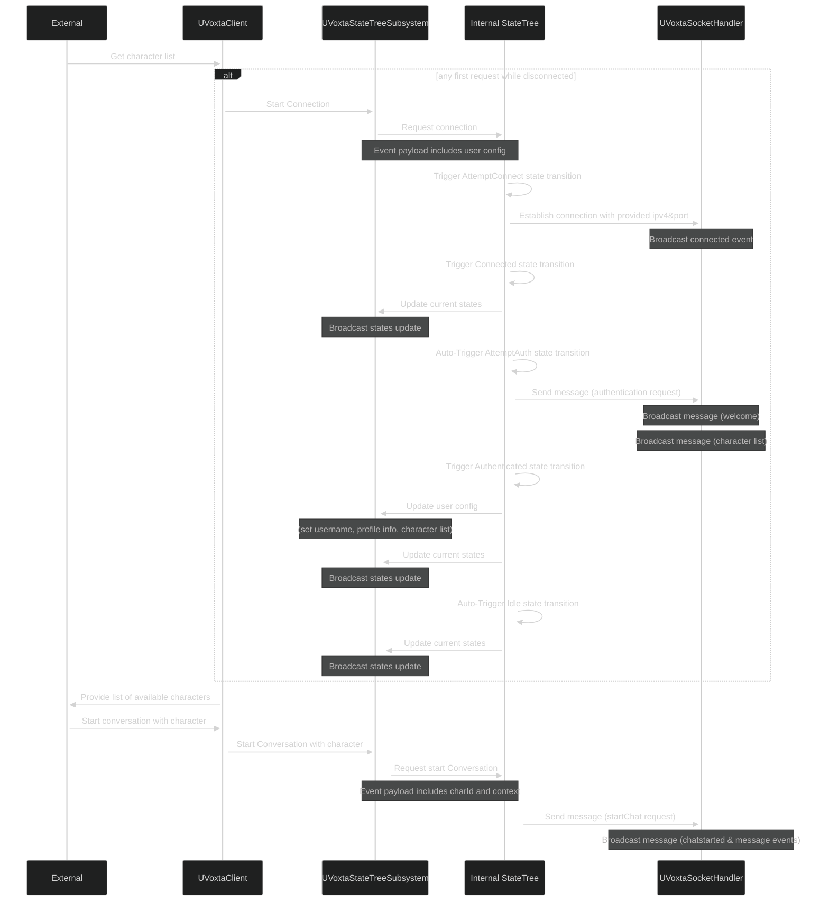

```mermaid
---
config:
  theme: dark
---
sequenceDiagram

    participant External

    External->>+UVoxtaClient: Get character list

    alt any first request while disconnected
        UVoxtaClient->>+UVoxtaStateTreeSubsystem: Start Connection

        UVoxtaStateTreeSubsystem->>+Internal StateTree: Request connection
            Note over UVoxtaStateTreeSubsystem,Internal StateTree: Event payload includes user config
        
        Internal StateTree->>+Internal StateTree: Trigger AttemptConnect state transition

        Internal StateTree->>+UVoxtaSocketHandler: Establish connection with provided ipv4&port
            Note over UVoxtaSocketHandler: Broadcast connected event

        Internal StateTree->>+Internal StateTree: Trigger Connected state transition

        Internal StateTree->>+UVoxtaStateTreeSubsystem: Update current states
            Note over UVoxtaStateTreeSubsystem: Broadcast states update

        Internal StateTree->>+Internal StateTree: Auto-Trigger AttemptAuth state transition

        Internal StateTree->>+UVoxtaSocketHandler: Send message (authentication request)
            Note over UVoxtaSocketHandler: Broadcast message (welcome)
            Note over UVoxtaSocketHandler: Broadcast message (character list)

        Internal StateTree->>+Internal StateTree: Trigger Authenticated state transition

        Internal StateTree->>+UVoxtaStateTreeSubsystem: Update user config
            Note over UVoxtaStateTreeSubsystem: (set username, profile info, character list)

        Internal StateTree->>+UVoxtaStateTreeSubsystem: Update current states
            Note over UVoxtaStateTreeSubsystem: Broadcast states update
            
        Internal StateTree->>+Internal StateTree: Auto-Trigger Idle state transition

        Internal StateTree->>+UVoxtaStateTreeSubsystem: Update current states
            Note over UVoxtaStateTreeSubsystem: Broadcast states update
    end

    UVoxtaClient->>+External: Provide list of available characters

    External->>+UVoxtaClient: Start conversation with character

    UVoxtaClient->>+UVoxtaStateTreeSubsystem: Start Conversation with character

    UVoxtaStateTreeSubsystem->>+Internal StateTree: Request start Conversation
        Note over UVoxtaStateTreeSubsystem,Internal StateTree: Event payload includes charId and context

    Internal StateTree->>+UVoxtaSocketHandler: Send message (startChat request)
        Note over UVoxtaSocketHandler: Broadcast message (chatstarted & message events)

```
